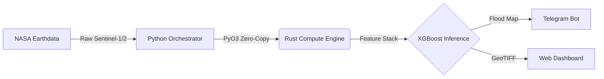

# 🛰️ Sumbawa-A.E.C.O (Autonomous ESG Compliance Oracle) v2.2



> **Autonomous Geospatial Monitoring Station for Real-time Flood Detection in Sumbawa Island, NTB.**
> **Bilingual Documentation:**  
> [](#-ringkasan-indonesian)
> [](#-executive-summary-english)

---

## 🇮🇩 Ringkasan (Indonesian)
**Sumbawa-A.E.C.O** adalah prototipe arsitektur tingkat produksi untuk monitoring banjir otonom yang menggabungkan **Multisensor Fusion** (Sentinel-1 SAR & Sentinel-2) dengan arsitektur *microservices* asinkron (FastAPI, Celery, Redis). Dirancang untuk mendeteksi genangan air di Pulau Sumbawa, mengeliminasi *false positive* menggunakan **Terrain Awareness** (DEMNAS), dan menyediakan pelaporan audit ESG secara otomatis. Sistem saat ini beroperasi menggunakan *pseudo-labels* (label turunan algoritmik) dan membutuhkan validasi lapangan independen untuk klaim akurasi final.

---

## 🇬🇧 Executive Summary (English)
**A.E.C.O v2.2** is a production-grade architectural prototype for real-time flood monitoring. It bridges the gap between raw satellite telemetry and actionable ESG insights using an asynchronous microservice stack (**FastAPI, Celery, Redis**) unified with Python (Inference) and Rust (Zero-Copy Parallel Compute via PyO3). The system currently operates on pseudo-labeled training data derived from SAR/NDWI thresholding and requires independent ground-truth validation for final accuracy claims.

---

## 🚀 Key Technical Features
- **Asynchronous Orchestration:** High-performance task queuing and microservice management using **FastAPI, Celery, and Redis** to eliminate API bottlenecks.
- **Automated Audit Engine:** Automated PDF Audit Reporting via `fpdf2`, generating ESG-compliant geospatial reports with satellite imagery overlays and vectorized flood statistics.
- **Scientific Precision Calculation:** Employs `pyproj.Geod` for rigorous WGS-84 ellipsoid-based geodesic area computations, combined with the Douglas-Peucker algorithm for high-fidelity polygon simplification.
- **Multisensor Fusion:** Sentinel-1 (SAR) for cloud-penetrating radar paired with Sentinel-2 (MSI) for optical NDWI cross-verification.
- **Terrain & Ocean Awareness:** Automated masking using SRTM/DEMNAS to eliminate terrain shadows and sea backscatter.
- **Rust-Accelerated Engine:** Core geospatial indices computed in Rust via PyO3/Rayon with zero-copy NumPy interoperability, massively reducing memory overhead.
- **Code Integrity:** Rigorous PyTest suite ensuring pipeline reliability across the entire asynchronous stack.

---

## 👁️ Visual Evidence: What A.E.C.O Sees
The following comparison illustrates the Multisensor Fusion Agreement pipeline in action:


---

## 📊 Performance & Current Status
- **Processing Architecture:** Celery + Redis distributed worker model.
- **Data Processed:** 40.46M pixels across Sumbawa Island (Sentinel-1: 777 MB, Sentinel-2: 174 MB, DEM: 80 MB).

### Measured Benchmark Results (Intel i7-8550U)
The following numbers were measured via `scripts/benchmark.py` on 2026-05-03:

| Operation | Area | Flood Polygons | Time |
|-----------|------|----------------|------|
| AOI Stats — Kab. Bima | 420,450 Ha | 1,649 | **1.04s** |
| AOI Stats — Kab. Sumbawa Barat | 176,299 Ha | 563 | **0.25s** |
| PDF Report Generation (with basemap) | — | — | **5.31s** |
| Total Pipeline (Stats + PDF) | — | — | **6.36s** |

### Model Training Metrics (Pseudo-Label Split)
The XGBoost model was trained on pseudo-labels generated by thresholding NDWI > 0.1 ∩ SAR_mask = 1 ∩ Slope < 10°. These are **not independent ground-truth labels**.

| Metric | XGBoost | Random Forest |
|--------|---------|---------------|
| Train/Test Accuracy | 99.85% | 100.00% |
| F1 (flood class) | 99.86% | 100.00% |
| Samples | 403,978 px | 403,978 px |

> [!CAUTION]
> **Pseudo-Label Circularity Warning:** The near-perfect scores above reflect the model re-learning its own thresholding rules, NOT real-world flood detection accuracy. The Random Forest achieving 100% is a textbook indicator of **data leakage** — the model memorises the labels it was derived from. These metrics are useful only for verifying that the ML pipeline executes correctly.

### Full-Map Evaluation (Prediction vs Pseudo-Labels)
When the trained model is applied back to the entire Sumbawa island raster (40.46M pixels):

| Metric | Value |
|--------|-------|
| Precision | 99.89% |
| Recall | 0.26% |
| F1-Score | **0.52%** |
| IoU | 0.26% |
| TP / FN | 56,086 / 21,482,821 |

> [!WARNING]
> **What this means:** The model is extremely conservative — it almost never predicts "flood" when applied to the full raster. This is a known consequence of severe class imbalance (flood ≈ 0.13% of pixels) combined with pseudo-label training. **True accuracy can only be determined with independent ground-truth data** (e.g., BPBD flood extent polygons or manual digitization from high-resolution imagery).

### What is Needed for Real Validation
- [ ] Independent ground-truth flood extent polygons (e.g., from BPBD NTB field reports for the Feb 2023 Taliwang flood or Feb 2025 Taliwang flood)
- [ ] Manual digitization of flood boundaries from Sentinel-2 true-color imagery on known flood dates
- [ ] Benchmark timing of PDF report generation and AOI processing under controlled conditions

**Mitigations applied and documented:**
1. **Class Imbalance Handling:** XGBoost's `scale_pos_weight` parameter is dynamically set to `n_negative / n_positive` to prevent the majority class from dominating gradient updates.
2. **Spatial Cross-Validation (SCV):** The evaluation pipeline supports tile-based spatial blocking to produce realistic generalisation estimates.
3. **Multisensor Fusion Agreement:** The strategy ($NDWI > 0.1 \cap SAR_{mask} = 1 \cap Slope < 10^\circ$) is designed to minimise false positives from terrain shadows and ocean backscatter.

---

## 🔬 Scientific Methodology

### Methodology & Signal Processing
**SAR Backscatter Physics (dB):**
Synthetic Aperture Radar (SAR) systems like Sentinel-1 emit microwave pulses and measure the return signal (backscatter). Smooth surfaces like calm water act as specular reflectors, scattering the radar pulse away from the sensor. This results in very low backscatter values (measured in decibels, dB), making water bodies appear dark in SAR imagery. 

**VV vs. VH Polarization:**
- **VV (Vertical transmit, Vertical receive):** Highly sensitive to surface roughness. It is optimal for detecting open water boundaries as the contrast between rough land and smooth water is prominent.
- **VH (Vertical transmit, Horizontal receive):** More sensitive to volume scattering (e.g., vegetation canopies). While less sensitive to surface water, it is crucial for identifying flooded vegetation where the radar signal double-bounces between the water surface and tree trunks.
Together, using both VV and VH allows for robust flood detection across different land cover types.

**NDWI (Normalized Difference Water Index):**
To complement SAR data, we utilize the NDWI from Sentinel-2 optical imagery. The formula leverages the high reflectance of water in the green band and strong absorption in the near-infrared (NIR) band:
$$ NDWI = \frac{Green - NIR}{Green + NIR} $$
Values greater than zero typically indicate water features, helping to cross-verify the SAR flood masks.

### Feature Engineering
| Band | Source | Description |
|------|--------|-------------|
| NDWI | Sentinel-2 (B3, B8) | Normalized Difference Water Index — computed in Rust via `flood_rs.calculate_ndwi()` |
| SAR Mask | Sentinel-1 (VV, VH) | Binary water detection via dB thresholding — computed in Rust via `flood_rs.calculate_sar_flood_mask()` |
| Slope | DEMNAS/SRTM | Terrain slope in degrees (numpy gradient) |
| VV | Sentinel-1 | VV-polarisation backscatter (dB) |
| VH | Sentinel-1 | VH-polarisation backscatter (dB) |

### Validation Strategy
- **Current:** Stratified random split (80/20) with `scale_pos_weight` correction on pseudo-labels.
- **Recommended:** Spatial Cross-Validation with tile-based blocking (k=5 spatial folds).
- **Required for Production Claims:** Independent validation against BNPB/BPBD ground-truth flood extent polygons or manually digitised flood boundaries.

### Known Limitations & Transparency
1. **⚠️ Pseudo-Label Circularity:** Training labels are derived from the same NDWI/SAR thresholding rules the model learns, resulting in artificially inflated train/test metrics (99%+). True generalisation performance is unknown until independent ground-truth data is obtained.
2. **⚠️ Full-Map Recall is Very Low (0.26%):** The model is extremely conservative when applied to the full raster, missing most flood pixels. This requires threshold tuning or retraining with balanced real-world labels.
3. EPSG:4326 degree-to-metre conversion uses equatorial approximation (±1.5% at −8°S latitude).
4. SAR thresholds are region-specific and may require recalibration for different geographies.
5. PDF report generation speed has not yet been formally benchmarked under controlled conditions.

---

## 🏭 Applied Environmental Engineering in Heavy Industry
A.E.C.O provides immense value for heavy industry and mining operations. By autonomously integrating radar and optical satellite telemetry, site managers can proactively monitor tailing dam integrities, assess logistical disruptions due to inundated haul roads, and maintain continuous, unbiased ESG (Environmental, Social, and Governance) compliance. This translates to reduced operational downtime and enhanced environmental stewardship in high-stakes industrial zones.

---

## 🛠️ Tech Stack
- **Orchestration & API:** FastAPI, Celery, Redis.
- **Engine:** Python 3.11+, Rust (Parallel Compute via PyO3), XGBoost.
- **Geospatial & Math:** `pyproj.Geod`, Douglas-Peucker algorithm, GDAL, Rasterio.
- **Reporting:** Automated PDF Generation Engine (`fpdf2`).
- **DevOps:** Docker (multi-stage build), PyTest, GitHub Actions CI (lint → test → docker-build).

---

## 📂 Project Structure
```text
.
├── api/                # FastAPI logic, endpoints, & tasks
├── redis/              # Redis configuration and queue management
├── reports/            # Generated Automated PDF Audit Reports
├── data/
│   ├── raw/            # Raw .tif satellite tiles
│   └── processed/      # Feature stack
├── outputs/
│   ├── models/         # Saved .pkl & .json metrics
│   └── predictions/    # Geospatial outputs & predictions
├── rust_engine/        # PyO3/Rayon zero-copy geospatial compute engine
│   ├── Cargo.toml
│   └── src/lib.rs      # High-performance indices calculation
├── src/                # Python pipeline modules
├── tests/              # PyTest units ensuring stack integrity
├── flood_agent.py      # Main Autonomous Agent
├── Dockerfile          # Multi-stage production build
├── docker-compose.yml  # Orchestration stack (API, Worker, Redis)
└── LICENSE             # MIT License
```

---

## 🚀 Deployment & Usage

### Option 1: Local Setup
```bash
git clone https://github.com/rizki-agustiawan/geo-ntb-flood-ai.git
cd geo-ntb-flood-ai
python -m venv venv
source venv/bin/activate
pip install -r requirements.txt

# Build the Rust engine (requires Rust toolchain)
cd rust_engine && maturin develop --release && cd ..

# Run Autonomous Agent
python flood_agent.py
```

### Option 2: Docker (Recommended)
```bash
# Set environment variables in .env (GEE_KEY, BMKG_ENDPOINT, RTK_BIN)
docker-compose up --build
```

---

## 📚 Academic References
- McFeeters, S. K. (1996). *The use of the Normalized Difference Water Index (NDWI) in the delineation of open water features.* Int. J. Remote Sens., 17(7), 1425–1432.
- Twele, A., et al. (2016). *Sentinel-1-based flood mapping: a fully automated processing chain.* Int. J. Remote Sens., 37(13), 2990–3004.
- Gorelick, N., et al. (2017). *Google Earth Engine: Planetary-scale geospatial analysis for everyone.* Remote Sens. Environ., 202, 18-27.
- Clement, M. A., et al. (2018). *Multi-temporal synthetic aperture radar flood mapping using change detection.* Remote Sens., 10(2), 298.
- Roberts, D. R., et al. (2017). *Cross-validation strategies for data with temporal, spatial, hierarchical, or phylogenetic structure.* Ecography, 40(8), 913–929.

---

## 📄 License
MIT License — See [LICENSE](LICENSE).