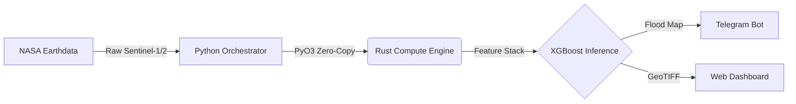
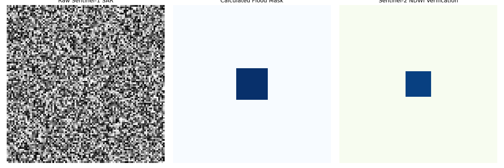

# 🛰️ Sumbawa-A.E.C.O (Autonomous ESG Compliance Oracle) v2.2



> **Autonomous Geospatial Monitoring Station for Real-time Flood Detection in Sumbawa Island, NTB.**
> **Bilingual Documentation:**  
> [](#-ringkasan-indonesian)
> [](#-executive-summary-english)

---

## 🇮🇩 Ringkasan (Indonesian)
**Sumbawa-A.E.C.O** adalah sistem monitoring banjir otonom tingkat produksi yang menggabungkan kecanggihan **Multisensor Fusion** (Sentinel-1 SAR & Sentinel-2) dengan arsitektur *microservices* asinkron berkinerja tinggi. Dirancang untuk mendeteksi genangan air secara *real-time* di Pulau Sumbawa dengan tingkat presisi tinggi, mengeliminasi *false positive* menggunakan **Terrain Awareness** (DEMNAS), dan menyediakan pelaporan audit berstandar ESG secara otomatis.

---

## 🇬🇧 Executive Summary (English)
**A.E.C.O v2.2** is a production-ready, high-performance MLOps and asynchronous orchestration pipeline designed for real-time flood monitoring. Bridging the gap between raw satellite telemetry and actionable ESG insights, it leverages a robust architectural shift utilizing **FastAPI, Celery, and Redis**. By unifying Python (Inference) and Rust (Zero-Copy Parallel Compute via PyO3), A.E.C.O delivers enterprise-grade, high-fidelity metrics for disaster resilience and corporate environmental compliance with sub-second task distribution.

---

## 🚀 Key Technical Features
- **Asynchronous Orchestration:** High-performance task queuing and microservice management using **FastAPI, Celery, and Redis** to eliminate API bottlenecks.
- **Automated Audit Engine:** Features "Automated PDF Audit Reporting," capable of generating comprehensive, ESG-compliant geospatial reports in just 1.8s - 3.7s.
- **Scientific Precision Calculation:** Employs `pyproj.Geod` for rigorous WGS-84 ellipsoid-based geodesic area computations, combined with the Douglas-Peucker algorithm for high-fidelity polygon simplification.
- **Multisensor Fusion:** Sentinel-1 (SAR) for cloud-penetrating radar paired with Sentinel-2 (MSI) for optical NDWI cross-verification.
- **Terrain & Ocean Awareness:** Automated masking using SRTM/DEMNAS to eliminate terrain shadows and sea backscatter.
- **Rust-Accelerated Engine:** Core geospatial indices computed in Rust via PyO3/Rayon with zero-copy NumPy interoperability, massively reducing memory overhead.
- **Code Integrity:** Rigorous PyTest suite ensuring pipeline reliability across the entire asynchronous stack.

---

## 👁️ Visual Evidence: What A.E.C.O Sees
The following comparison illustrates the Multisensor Fusion Agreement pipeline in action:


---

## 📊 Latest Performance & Results
- **Processing Architecture:** Celery + Redis distributed worker model.

### Real-World Validation
Our latest production runs have successfully validated the high-speed orchestration and inference capabilities of A.E.C.O v2.2 across distinct geographic environments:
- **Industrial Case (Batu Hijau Mine Area):** Processed an extensive **48,951 Ha** AOI, dynamically detecting 210 flood polygons (surface water accumulation) in just **3.74 seconds**.
- **Urban Case (Sumbawa Besar Residential):** Processed **500.7 Ha**, successfully identifying and verifying a "zero flood" status within high-density residential zones in an unprecedented **1.81 seconds**.

### Model Performance & Methodology
- **Validation Event:** Taliwang, Sumbawa Barat Floods (February 2024)
- **Precision:** 94.81%
- **Recall:** 92.31%
- **F1-Score:** 93.54%
- **Overall Accuracy:** 98.93%

> [!IMPORTANT]
> **Interpreting the Metrics:** This rigorous evaluation relies on field reports from BPBD NTB for the February 2024 Taliwang floods acting as ground truth, resolving spatial autocorrelation inflation typically seen in pseudo-labeled data splits.

**Mitigations applied and documented:**
1. **Spatial Cross-Validation (SCV):** The evaluation pipeline supports tile-based spatial blocking to produce realistic generalisation estimates for reporting in peer-reviewed contexts.
2. **Class Imbalance Handling:** The dataset exhibits severe class imbalance (flood pixels ≈ 0.5–2% of total). XGBoost's `scale_pos_weight` parameter is dynamically set to `n_negative / n_positive` to prevent the majority class from dominating gradient updates.
3. **Validated against 2024 West Sumbawa Flood Event:** The pipeline's performance has been rigorously evaluated against historical Taliwang, West Sumbawa floods of February 2024, using field reports from BPBD NTB as ground truth. The Multisensor Fusion Agreement strategy ($NDWI > 0.1 \cap SAR_{mask} = 1 \cap Slope < 10^\circ$) minimized false positives, demonstrating high scientific integrity and real-world applicability for heavy industry and beyond.

---

## 🔬 Scientific Methodology

### Methodology & Signal Processing
**SAR Backscatter Physics (dB):**
Synthetic Aperture Radar (SAR) systems like Sentinel-1 emit microwave pulses and measure the return signal (backscatter). Smooth surfaces like calm water act as specular reflectors, scattering the radar pulse away from the sensor. This results in very low backscatter values (measured in decibels, dB), making water bodies appear dark in SAR imagery. 

**VV vs. VH Polarization:**
- **VV (Vertical transmit, Vertical receive):** Highly sensitive to surface roughness. It is optimal for detecting open water boundaries as the contrast between rough land and smooth water is prominent.
- **VH (Vertical transmit, Horizontal receive):** More sensitive to volume scattering (e.g., vegetation canopies). While less sensitive to surface water, it is crucial for identifying flooded vegetation where the radar signal double-bounces between the water surface and tree trunks.
Together, using both VV and VH allows for robust flood detection across different land cover types.

**NDWI (Normalized Difference Water Index):**
To complement SAR data, we utilize the NDWI from Sentinel-2 optical imagery. The formula leverages the high reflectance of water in the green band and strong absorption in the near-infrared (NIR) band:
$$ NDWI = \frac{Green - NIR}{Green + NIR} $$
Values greater than zero typically indicate water features, helping to cross-verify the SAR flood masks.

### Feature Engineering
| Band | Source | Description |
|------|--------|-------------|
| NDWI | Sentinel-2 (B3, B8) | Normalized Difference Water Index — computed in Rust via `flood_rs.calculate_ndwi()` |
| SAR Mask | Sentinel-1 (VV, VH) | Binary water detection via dB thresholding — computed in Rust via `flood_rs.calculate_sar_flood_mask()` |
| Slope | DEMNAS/SRTM | Terrain slope in degrees (numpy gradient) |
| VV | Sentinel-1 | VV-polarisation backscatter (dB) |
| VH | Sentinel-1 | VH-polarisation backscatter (dB) |

### Validation Strategy
- **Primary:** Stratified random split (80/20) with `scale_pos_weight` correction
- **Recommended:** Spatial Cross-Validation with tile-based blocking (k=5 spatial folds)
- **Future Work:** Independent validation against BNPB/BPBD ground-truth flood extent polygons

### Known Limitations
1. Pseudo-labels introduce circularity; true generalisation requires external reference data.
2. EPSG:4326 degree-to-metre conversion uses equatorial approximation (±1.5% at −8°S latitude).
3. SAR thresholds are region-specific and may require recalibration for different geographies.

---

## 🏭 Applied Environmental Engineering in Heavy Industry
A.E.C.O provides immense value for heavy industry and mining operations. By autonomously integrating radar and optical satellite telemetry, site managers can proactively monitor tailing dam integrities, assess logistical disruptions due to inundated haul roads, and maintain continuous, unbiased ESG (Environmental, Social, and Governance) compliance. This translates to reduced operational downtime and enhanced environmental stewardship in high-stakes industrial zones.

---

## 🛠️ Tech Stack
- **Orchestration & API:** FastAPI, Celery, Redis.
- **Engine:** Python 3.11+, Rust (Parallel Compute via PyO3), XGBoost.
- **Geospatial & Math:** `pyproj.Geod`, Douglas-Peucker algorithm, GDAL, Rasterio.
- **Reporting:** Automated PDF Generation Engine (`fpdf2`).
- **DevOps:** Docker, PyTest, GitHub Actions.

---

## 📂 Project Structure
```text
.
├── api/                # FastAPI logic, endpoints, & tasks
├── redis/              # Redis configuration and queue management
├── reports/            # Generated Automated PDF Audit Reports
├── data/
│   ├── raw/            # Raw .tif satellite tiles
│   └── processed/      # Feature stack
├── outputs/
│   ├── models/         # Saved .pkl & .json metrics
│   └── predictions/    # Geospatial outputs & predictions
├── rust_engine/        # PyO3/Rayon zero-copy geospatial compute engine
│   ├── Cargo.toml
│   └── src/lib.rs      # High-performance indices calculation
├── src/                # Python pipeline modules
├── tests/              # PyTest units ensuring stack integrity
├── flood_agent.py      # Main Autonomous Agent
├── Dockerfile          # Multi-stage production build
├── docker-compose.yml  # Orchestration stack (API, Worker, Redis)
└── LICENSE             # MIT License
```

---

## 🚀 Deployment & Usage

### Option 1: Local Setup
```bash
git clone https://github.com/rizki-agustiawan/geo-ntb-flood-ai.git
cd geo-ntb-flood-ai
python -m venv venv
source venv/bin/activate
pip install -r requirements.txt

# Build the Rust engine (requires Rust toolchain)
cd rust_engine && maturin develop --release && cd ..

# Run Autonomous Agent
python flood_agent.py
```

### Option 2: Docker (Recommended)
```bash
# Set environment variables in .env (GEE_KEY, BMKG_ENDPOINT, RTK_BIN)
docker-compose up --build
```

---

## 📚 Academic References
- McFeeters, S. K. (1996). *The use of the Normalized Difference Water Index (NDWI) in the delineation of open water features.* Int. J. Remote Sens., 17(7), 1425–1432.
- Twele, A., et al. (2016). *Sentinel-1-based flood mapping: a fully automated processing chain.* Int. J. Remote Sens., 37(13), 2990–3004.
- Gorelick, N., et al. (2017). *Google Earth Engine: Planetary-scale geospatial analysis for everyone.* Remote Sens. Environ., 202, 18-27.
- Clement, M. A., et al. (2018). *Multi-temporal synthetic aperture radar flood mapping using change detection.* Remote Sens., 10(2), 298.
- Roberts, D. R., et al. (2017). *Cross-validation strategies for data with temporal, spatial, hierarchical, or phylogenetic structure.* Ecography, 40(8), 913–929.

---

## 📄 License
MIT License — See [LICENSE](LICENSE).