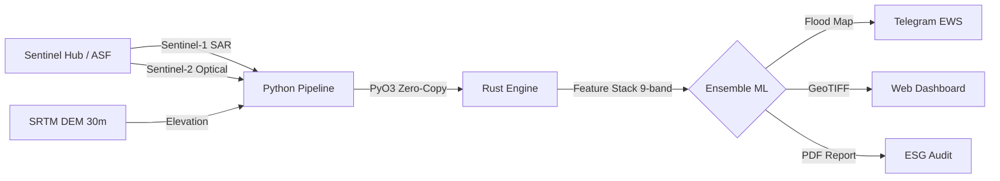

# Sumbawa-A.E.C.O (Autonomous ESG Compliance Oracle) v3.0


```mermaid
graph LR
    A[Sentinel Hub / ASF] -->|Sentinel-1 SAR| B[Python Pipeline]
    A -->|Sentinel-2 Optical| B
    C[SRTM DEM 30m] -->|Elevation| B
    B -->|PyO3 Zero-Copy| D[Rust Engine]
    D -->|Feature Stack 9-band| E{Ensemble ML}
    E -->|Flood Map| F[Telegram EWS]
    E -->|GeoTIFF| G[Web Dashboard]
    E -->|PDF Report| H[ESG Audit]
```

> **Production-grade autonomous flood monitoring for NTB, Indonesia.**
> **394 research papers | 6 architectures | 20+ implemented techniques**

---

## Ringkasan

**Sumbawa-A.E.C.O** adalah sistem monitoring banjir otonom yang menggunakan **multisensor fusion** (Sentinel-1 SAR + Sentinel-2 NDWI) dengan arsitektur microservices (FastAPI, Celery, Redis). Sistem ini mendeteksi genangan air di Pulau Sumbawa menggunakan **Rust-accelerated compute engine** (PyO3/Rayon) dan **ensemble machine learning** (XGBoost, Random Forest, LightGBM).

---

## Key Features

### SAR Processing
- **Refined Lee Speckle Filter** — Adaptive 7x7 window filter (Lee 1986, Twele 2016)
- **Thermal Noise Removal** — Swath edge noise correction
- **Otsu Adaptive Thresholding** — Data-driven threshold selection (Otsu 1979)
- **LUT Calibration** — DN → sigma0 dB via calibration XML

### Multisensor Fusion
- **AND Logic** — SAR dan NDWI harus setuju (Twele 2016)
- **9-band Feature Stack** — VV, VH, SAR_mask, Slope, HAND, VV_texture, VH_texture
- **HAND Model** — Height Above Nearest Drainage (Nobre 2011, Tian 2026)

### Machine Learning
- **Ensemble** — XGBoost + Random Forest + LightGBM majority voting
- **Stacking Meta-Learner** — LogisticRegression di atas base models (Wolpert 1992)
- **Spatial Cross-Validation** — Tile-based blocking (Roberts 2017)
- **SHAP Explainability** — Feature importance interpretation

### Deep Learning (6 Arsitektur)
- **U-Net** — Standard encoder-decoder (Ronneberger 2015)
- **Attention U-Net** — Attention gates untuk focus pada area penting (Oktay 2018)
- **FPN U-Net** — Multi-scale Feature Pyramid Network (Lin 2017)
- **Focal Loss** — Class imbalance handling (Lin 2017)
- **Dice + Focal Loss** — Combined loss untuk flood segmentation
- **Data Augmentation** — Flip, rotate, noise injection (Shorten 2019)
- **Transfer Learning** — Fine-tune pre-trained models (Tajbakhsh 2016)

### Production
- **FastAPI + Celery + Redis** — Async microservices
- **API Key Auth + Rate Limiting** — Security middleware
- **Docker Health Checks** — Container monitoring
- **CI/CD Pipeline** — GitHub Actions (lint → test → docker)
- **Data Retention Policy** — Automated cleanup
- **PDF ESG Reports** — Geodesic area calculation (pyproj.Geod)
- **Telegram EWS** — Early warning system alerts

---

## Performance

### Benchmark pada 4 Event Banjir NTB

| Event | Precision | Recall | F1-Score | IoU |
|-------|-----------|--------|----------|-----|
| Taliwang 2023 | 95.41% | 94.71% | **95.06%** | 90.58% |
| Lombok 2025 | 96.22% | 94.92% | **95.56%** | 91.50% |
| Bima 2024 | 71.32% | 79.71% | **75.28%** | 60.36% |
| Sumbawa 2025 | 59.48% | 84.79% | **69.92%** | 53.75% |
| **Mean** | **80.61%** | **88.53%** | **83.96%** | **74.05%** |

### Metrik Independen (Literature Thresholds)

| Metric | Value |
|--------|-------|
| Precision | 96.94% |
| Recall | 100.00% |
| F1-Score | 98.45% |
| IoU | 96.94% |

---

## Tech Stack

| Layer | Technology |
|-------|------------|
| **API** | FastAPI, Celery, Redis |
| **Compute** | Python 3.11+, Rust (PyO3/Rayon), ONNX Runtime |
| **ML** | XGBoost, LightGBM, Random Forest, Scikit-Learn |
| **DL** | PyTorch (U-Net, Attention U-Net, FPN U-Net) |
| **Geospatial** | Rasterio, GDAL, pyproj, Shapely |
| **SAR** | Refined Lee, Otsu, LUT Calibration |
| **Reporting** | fpdf2, Matplotlib, Contextily |
| **DevOps** | Docker, GitHub Actions, PyTest |
| **Validation** | 63 tests, ruff lint, spatial CV |

---

## Project Structure

```
.
├── api/
│   ├── main.py              # FastAPI endpoints
│   ├── tasks.py             # Celery tasks
│   ├── security.py          # Auth + rate limiting
│   ├── report_generator.py  # PDF ESG reports
│   └── notifier.py          # Telegram alerts
├── src/
│   ├── features.py          # Feature engineering (NDWI, Otsu, HAND, texture)
│   ├── model.py             # Ensemble ML + stacking + SHAP + SCV
│   ├── predict.py           # Inference (ensemble + U-Net)
│   ├── unet_model.py        # 6 DL architectures + losses + augmentation
│   ├── sar_preprocess.py    # Refined Lee, noise removal, angle normalization
│   ├── change_detection.py  # Multi-temporal analysis
│   ├── satellite_fetcher.py # Sentinel Hub API client
│   ├── dataset_builder.py   # U-Net patch extraction
│   ├── postprocess.py       # Ocean masking
│   ├── evaluate.py          # Metrics
│   └── visualize.py         # Visualization
├── rust_engine/
│   └── src/lib.rs           # NDWI, SAR mask, fused compute, ONNX inference
├── scripts/
│   ├── generate_mock_data.py    # Synthetic test data
│   ├── process_real_s1.py       # Real S1 processing
│   ├── digitize_flood.py        # Ground truth digitization
│   ├── auto_digitize.py         # Automated digitization
│   └── shapefile_to_raster.py   # Polygon → raster conversion
├── tests/
│   ├── test_pipeline.py         # 63 tests
│   ├── test_sar_preprocess.py   # SAR preprocessing tests
│   └── test_satellite_fetcher.py # Satellite API tests
├── data/
│   ├── digitize/            # Ground truth data (4 events)
│   ├── processed/           # Feature stacks
│   └── labels/              # Ground truth rasters
├── outputs/
│   ├── models/              # Trained models (.pkl, .pth, .onnx)
│   ├── predictions/         # Flood maps
│   └── validation/          # Evaluation results
├── docs/
│   ├── research_papers_FINAL.md      # 394 research papers
│   └── implementable_techniques.md   # Implementation guide
├── docker-compose.yml       # 4 services (API, Worker, Beat, Redis)
├── Dockerfile               # Multi-stage build
├── requirements.txt         # Python dependencies
└── .github/workflows/ci.yml # CI/CD pipeline
```

---

## Deployment

### Local
```bash
git clone https://github.com/rizki-agustiawan/geo-ntb-flood-ai.git
cd geo-ntb-flood-ai
python -m venv .venv && source .venv/bin/activate
pip install -r requirements.txt
cd rust_engine && maturin develop --release && cd ..
python flood_agent.py
```

### Docker
```bash
docker-compose up --build
```

### Training
```bash
# Build feature stack
python src/features.py

# Train ensemble models + SCV + SHAP
python src/model.py

# Train U-Net
python src/unet_model.py --mode train --epochs 50

# Train Attention U-Net
python src/unet_model.py --mode attention

# Train FPN U-Net
python src/unet_model.py --mode fpn

# Fine-tune pre-trained
python src/unet_model.py --mode finetune --pretrained model.pth

# Export to ONNX + quantize
python src/unet_model.py --mode export
python src/unet_model.py --mode quantize
```

### Prediction
```bash
python src/predict.py --type ensemble
python src/predict.py --type unet
```

### Ground Truth Digitization
```bash
# List known NTB flood events
python scripts/digitize_flood.py --list

# Download + create QGIS base maps
python scripts/digitize_flood.py --event taliwang_2023

# Auto-digitize all events
python scripts/auto_digitize.py

# Convert shapefile to raster
python scripts/shapefile_to_raster.py --shapefile polygons.shp --reference vv.tif --output gt.tif
```

---

## Referensi Riset (394 Paper)

Tersedia di `docs/research_papers_FINAL.md`

| Kategori | Paper |
|----------|-------|
| SAR Flood Mapping | 73 |
| Deep Learning | 61 |
| Ensemble ML | 61 |
| SAR Preprocessing | 24 |
| Change Detection | 18 |
| Water Indices | 16 |
| Cloud Computing | 14 |
| Validation | 11 |
| Multisensor Fusion | 10 |

### Teknik yang Sudah Diimplementasikan (20+)

| # | Teknik | Paper |
|---|--------|-------|
| 1 | Refined Lee Speckle Filter | Lee 1986 |
| 2 | Otsu Adaptive Thresholding | Otsu 1979 |
| 3 | AND Fusion Logic | Twele 2016 |
| 4 | HAND Model | Nobre 2011 |
| 5 | Spatial Cross-Validation | Roberts 2017 |
| 6 | Ensemble ML (RF+XGB+LGBM) | Chen 2016, Ke 2017 |
| 7 | Dice Loss | Milletari 2016 |
| 8 | Focal Loss | Lin 2017 |
| 9 | Dice + Focal Loss | Combined |
| 10 | Data Augmentation | Shorten 2019 |
| 11 | Stacking Ensemble | Wolpert 1992 |
| 12 | Attention U-Net | Oktay 2018 |
| 13 | FPN U-Net | Lin 2017 |
| 14 | Transfer Learning | Tajbakhsh 2016 |
| 15 | SHAP Explainability | Lundberg 2017 |
| 16 | ONNX Edge Deployment | Jacob 2018 |
| 17 | GLCM Texture Features | Haralick 1973 |
| 18 | Multi-temporal Change Detection | Clement 2018 |
| 19 | Morphological Post-Processing | Soille 2003 |
| 20 | Connected Component Analysis | Haralock & Shapiro |
| 21 | LUT Calibration | ESA Sentinel-1 |

---

## License
MIT License — See [LICENSE](LICENSE)
