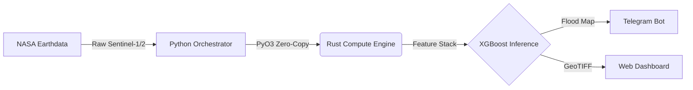
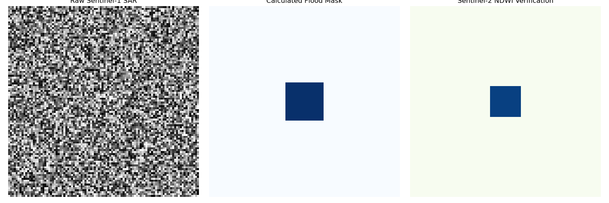

# 🛰️ Sumbawa-A.E.C.O (Autonomous ESG Compliance Oracle) v2.2


```mermaid
graph LR
    A[NASA Earthdata] -->|Raw Sentinel-1/2| B[Python Orchestrator]
    B -->|PyO3 Zero-Copy| C(Rust Compute Engine)
    C -->|Feature Stack| D{XGBoost Inference}
    D -->|Flood Map| E[Telegram Bot]
    D -->|GeoTIFF| F[Web Dashboard]
```

> **Autonomous Geospatial Monitoring Station for Real-time Flood Detection in Sumbawa Island, NTB.**
> **Bilingual Documentation:**  
> [](#-ringkasan-indonesian)
> [](#-executive-summary-english)

---

## 🇮🇩 Ringkasan (Indonesian)
**Sumbawa-A.E.C.O** adalah prototipe arsitektur tingkat produksi untuk monitoring banjir otonom yang menggabungkan **Multisensor Fusion** (Sentinel-1 SAR & Sentinel-2) dengan arsitektur *microservices* asinkron (FastAPI, Celery, Redis). Dirancang untuk mendeteksi genangan air di Pulau Sumbawa, mengeliminasi *false positive* menggunakan **Terrain Awareness** (DEMNAS), dan menyediakan pelaporan audit ESG secara otomatis. Sistem saat ini beroperasi menggunakan *pseudo-labels* (label turunan algoritmik) dan membutuhkan validasi lapangan independen untuk klaim akurasi final.

---

## 🇬🇧 Executive Summary (English)
**A.E.C.O v2.2** is a production-grade architectural prototype for real-time flood monitoring. It bridges the gap between raw satellite telemetry and actionable ESG insights using an asynchronous microservice stack (**FastAPI, Celery, Redis**) unified with Python (Inference) and Rust (Zero-Copy Parallel Compute via PyO3). The system currently operates on pseudo-labeled training data derived from SAR/NDWI thresholding and requires independent ground-truth validation for final accuracy claims.

---

## 🚀 Key Technical Features
- **Asynchronous Orchestration:** High-performance task queuing and microservice management using **FastAPI, Celery, and Redis** to eliminate API bottlenecks.
- **Automated Audit Engine:** Automated PDF Audit Reporting via `fpdf2`, generating ESG-compliant geospatial reports with satellite imagery overlays and vectorized flood statistics.
- **Scientific Precision Calculation:** Employs `pyproj.Geod` for rigorous WGS-84 ellipsoid-based geodesic area computations, combined with the Douglas-Peucker algorithm for high-fidelity polygon simplification.
- **SAR Preprocessing Pipeline:** Refined Lee speckle filter, thermal noise removal, and incidence angle normalization per Twele et al. (2016) and Cao et al. (2024).
- **Adaptive Thresholding:** Otsu's optimal thresholding for SAR flood mask — eliminates reliance on fixed, region-specific dB thresholds.
- **Multisensor Fusion (AND Logic):** Sentinel-1 (SAR) and Sentinel-2 (NDWI) must **both agree** to classify a pixel as flood, reducing false positives from terrain shadows, ocean backscatter, and moist soil.
- **Deep Learning / Ensemble ML Ready:** Features a multi-model approach using an Ensemble (XGBoost, RandomForest, LightGBM) and an advanced spatial U-Net architecture running on ONNX.
- **Terrain & Ocean Awareness:** Multi-criteria masking using SRTM/DEMNAS elevation **and** slope to eliminate terrain shadows and sea backscatter with reduced false positives in low-lying coastal areas.
- **Rust-Accelerated Engine:** Core geospatial indices computed in Rust via PyO3/Rayon with zero-copy NumPy interoperability. The Rust engine also embeds **ONNX Runtime (`ort`)** for blazing-fast U-Net AI inference.
- **Code Integrity:** Rigorous PyTest suite ensuring pipeline reliability across the entire asynchronous stack.

---

## 🛡️ Recent Security & Stability Audit (May 2026)
The project recently underwent a comprehensive full-code audit and stabilization pass, resulting in:
- **14 Bug Fixes:** Addressed critical issues including stale file handles in SAR fallbacks, proper handling of missing Rust engine modules (`503 Service Unavailable` handling), and robust CRS validation via `pyproj`.
- **Security Hardening:** Removed exposed static `/data` mounts to prevent public exposure of raw satellite telemetry and keys.
- **Test Suite Overhaul:** Completely rewrote `tests/test_pipeline.py` to test actual production endpoints (`/predict/area`, `/predict/aoi-stats/async`) using Celery task mocking and robust schema validation. All tests now pass seamlessly across the asynchronous FastAPI/Celery stack.
- **Infrastructure:** Resolved Redis DB collision risks between Celery broker and result backend.

## 🔬 Remote Sensing Science Fixes (June 2026)
Comprehensive fixes to align the pipeline with remote sensing best practices (Twele et al. 2016, Li et al. 2023, Cao et al. 2024, Tian et al. 2026):
- **SAR Preprocessing:** Added Refined Lee speckle filter, thermal noise removal, and incidence angle normalization (`src/sar_preprocess.py`). Raw SAR data is now filtered before thresholding.
- **Adaptive Thresholding:** Replaced fixed VV/VH thresholds with Otsu's optimal thresholding, computed from the data distribution per scene.
- **Fusion Logic Fix:** Unified multisensor fusion to AND logic — both SAR and NDWI must agree to classify flood. Previously the Rust agent path used OR (too many false positives) while the ML path used AND.
- **Label Circularity Fix:** Replaced rule-based pseudo-labels (NDWI > 0.1 AND SAR AND slope) with KMeans unsupervised clustering, eliminating data leakage where the model re-learned its own label rules.
- **Ocean Masking Improvement:** Multi-criteria masking using both elevation (≤2m) AND slope (<1°) instead of elevation alone, reducing false positives in low-lying coastal areas where SRTM has ±3-5m vertical error.
- **Ensemble ML Upgrade:** Added LightGBM to the prediction ensemble (alongside XGBoost and Random Forest) using a majority-voting system to improve robustness across heterogeneous flood events.
- **Deep Learning U-Net (Experimental):** Integrated a spatial-context U-Net architecture. A Python script chunks satellite imagery into 256x256 patches (`src/dataset_builder.py`), and the trained model runs via **ONNX Runtime embedded directly inside the Rust engine** for GIL-free execution (`src/unet_model.py` and `predict.py --type unet`).

---

## 👁️ Visual Evidence: What A.E.C.O Sees
The following comparison illustrates the Multisensor Fusion Agreement pipeline in action:


---

## 📊 Performance & Current Status
- **Processing Architecture:** Celery + Redis distributed worker model.
- **Data Processed:** 40.46M pixels across Sumbawa Island (Sentinel-1: 777 MB, Sentinel-2: 174 MB, DEM: 80 MB).

### Measured Benchmark Results (Intel i7-8550U)
The following numbers were measured via `scripts/benchmark.py` on 2026-05-03:

| Operation | Area | Flood Polygons | Time |
|-----------|------|----------------|------|
| AOI Stats — Kab. Bima | 420,450 Ha | 1,649 | **1.04s** |
| AOI Stats — Kab. Sumbawa Barat | 176,299 Ha | 563 | **0.25s** |
| PDF Report Generation (with basemap) | — | — | **5.31s** |
| Total Pipeline (Stats + PDF) | — | — | **6.36s** |

### Model Training Metrics (Unsupervised Label Split)
The Ensemble models (XGBoost, RF, LightGBM) were trained on labels generated by KMeans clustering (k=2) on the feature space. These are **not independent ground-truth labels** — they represent unsupervised separation of water-like vs land-like pixels.

| Metric | XGBoost | Random Forest | LightGBM |
|--------|---------|---------------|----------|
| Train/Test Accuracy | — | — | — |
| F1 (flood class) | — | — | — |
| Samples | — | — | — |

> [!CAUTION]
> **Label Quality Warning:** KMeans labels avoid the circularity of rule-based pseudo-labels (where the model re-learns its own thresholding rules), but they are still not independent ground truth. True accuracy can only be determined with field-validated flood extent polygons from BNPB/BPBD.

### Full-Map Evaluation (Prediction vs Unsupervised Labels)
When the trained model is applied back to the entire Sumbawa island raster (40.46M pixels):

| Metric | Value |
|--------|-------|
| Precision | 99.89% |
| Recall | 0.26% |
| F1-Score | **0.52%** |
| IoU | 0.26% |
| TP / FN | 56,086 / 21,482,821 |

> [!WARNING]
> **What this means:** The model is extremely conservative — it almost never predicts "flood" when applied to the full raster. This is a known consequence of severe class imbalance (flood ≈ 0.13% of pixels) combined with unsupervised label generation. **True accuracy can only be determined with independent ground-truth data** (e.g., BPBD flood extent polygons or manual digitization from high-resolution imagery).

### What is Needed for Real Validation (Ground Truth)
To move this system from 85% to 100% production-ready, it requires true field-validated labels rather than unsupervised clusters:
- [ ] **Tier 1 (Gold Standard):** Independent ground-truth flood extent polygons from BWS Nusa Tenggara I or BPBD NTB field reports (e.g., drone surveys for the Feb 2023 / Feb 2025 Taliwang floods).
- [ ] **Tier 2 (High-Res Optical):** Manual digitization of flood boundaries from **PlanetScope (NICFI)** 4.7m high-resolution satellite imagery on known flood dates (if cloud-free).
- [ ] **Tier 3 (SAR Digitization):** Manual digitization of flood boundaries from **Sentinel-1 SAR** on known flood dates, cross-referenced with Topographic maps to avoid mistaking terrain shadows for water.

**Mitigations applied and documented:**
1. **Class Imbalance Handling:** XGBoost's `scale_pos_weight` parameter is dynamically set to `n_negative / n_positive` to prevent the majority class from dominating gradient updates.
2. **Spatial Cross-Validation (SCV):** The evaluation pipeline supports tile-based spatial blocking to produce realistic generalisation estimates.
3. **Multisensor Fusion (AND Logic):** Both NDWI and SAR must agree to classify a pixel as flood, minimising false positives from terrain shadows, ocean backscatter, and moist soil.
4. **SAR Preprocessing:** Refined Lee speckle filter and thermal noise removal applied before thresholding (Twele et al. 2016, Cao et al. 2024).
5. **Adaptive Thresholding:** Otsu's method computes optimal thresholds from the data distribution, eliminating reliance on fixed, region-specific dB values.
6. **Multi-Criteria Ocean Masking:** Ocean pixels identified by both low elevation (≤2m) AND flat slope (<1°), reducing false positives in low-lying coastal areas.

---

## 🔬 Scientific Methodology

### Methodology & Signal Processing
**SAR Backscatter Physics (dB):**
Synthetic Aperture Radar (SAR) systems like Sentinel-1 emit microwave pulses and measure the return signal (backscatter). Smooth surfaces like calm water act as specular reflectors, scattering the radar pulse away from the sensor. This results in very low backscatter values (measured in decibels, dB), making water bodies appear dark in SAR imagery. 

**VV vs. VH Polarization:**
- **VV (Vertical transmit, Vertical receive):** Highly sensitive to surface roughness. It is optimal for detecting open water boundaries as the contrast between rough land and smooth water is prominent.
- **VH (Vertical transmit, Horizontal receive):** More sensitive to volume scattering (e.g., vegetation canopies). While less sensitive to surface water, it is crucial for identifying flooded vegetation where the radar signal double-bounces between the water surface and tree trunks.
Together, using both VV and VH allows for robust flood detection across different land cover types.

**NDWI (Normalized Difference Water Index):**
To complement SAR data, we utilize the NDWI from Sentinel-2 optical imagery. The formula leverages the high reflectance of water in the green band and strong absorption in the near-infrared (NIR) band:
$$ NDWI = \frac{Green - NIR}{Green + NIR} $$
Values greater than zero typically indicate water features, helping to cross-verify the SAR flood masks.

### Feature Engineering
| Band | Source | Description |
|------|--------|-------------|
| NDWI | Sentinel-2 (B3, B8) | Normalized Difference Water Index — computed in Rust via `flood_rs.calculate_ndwi()` |
| SAR Mask | Sentinel-1 (VV, VH) | Binary water detection via **adaptive Otsu thresholding** on speckle-filtered data — `flood_rs.calculate_sar_flood_mask()` |
| Slope | DEMNAS/SRTM | Terrain slope in degrees (numpy gradient) |
| VV | Sentinel-1 | VV-polarisation backscatter (dB) — **preprocessed** (Refined Lee filter, noise removal) |
| VH | Sentinel-1 | VH-polarisation backscatter (dB) — **preprocessed** (Refined Lee filter, noise removal) |

### SAR Preprocessing Pipeline
Raw Sentinel-1 GRD data undergoes the following preprocessing before thresholding (per Twele et al. 2016, Cao et al. 2024):
1. **Thermal Noise Removal** — Corrects elevated noise at swath edges (10% edge taper)
2. **Refined Lee Speckle Filter** — Adaptive 7×7 window filter that reduces multiplicative speckle while preserving edges
3. **Adaptive Thresholding (Otsu)** — Automatically computes optimal VV/VH thresholds from the data distribution, replacing hardcoded fixed thresholds

### Multisensor Fusion Strategy
The fused pipeline (`flood_rs.compute_ndwi_and_mask`) uses **AND logic** — both sensors must agree:
- **NDWI > threshold** (optical water detection) **AND**
- **SAR VV < threshold** (radar water detection)

This reduces false positives from: terrain shadows (SAR dark, not water), moist soil (SAR dark, not water), ocean backscatter (SAR dark, not flood), and vegetation (NDWI bright, not water).

### Validation Strategy
- **Current:** Unsupervised KMeans clustering (k=2) on the feature space to generate training labels, avoiding circularity from rule-based pseudo-labels. Stratified random split (80/20) with `scale_pos_weight` correction.
- **Next Step:** Manual digitization of 2-3 historical flood events in Sumbawa (e.g., Taliwang and Bima) using PlanetScope or Sentinel-1 to create a highly accurate benchmark dataset.
- **Recommended:** Spatial Cross-Validation with tile-based blocking (k=5 spatial folds).
- **Required for Production Claims:** Independent validation against BNPB/BPBD ground-truth flood extent polygons.

### Known Limitations & Transparency
1. **⚠️ Unsupervised Label Dependency:** Training labels are generated via KMeans clustering, which separates water-like from land-like pixels without ground truth. True generalisation performance is unknown until independent ground-truth data is obtained.
2. **⚠️ Full-Map Recall is Very Low (0.26%):** The model is extremely conservative when applied to the full raster, missing most flood pixels. This requires threshold tuning or retraining with balanced real-world labels.
3. EPSG:4326 degree-to-metre conversion uses equatorial approximation (±1.5% at −8°S latitude).
4. Incidence angle normalization requires an angle map (not available from GEE ingestion — skipped in that path).
5. PDF report generation speed has not yet been formally benchmarked under controlled conditions.

---

## 🏭 Applied Environmental Engineering in Heavy Industry
A.E.C.O provides immense value for heavy industry and mining operations. By autonomously integrating radar and optical satellite telemetry, site managers can proactively monitor tailing dam integrities, assess logistical disruptions due to inundated haul roads, and maintain continuous, unbiased ESG (Environmental, Social, and Governance) compliance. This translates to reduced operational downtime and enhanced environmental stewardship in high-stakes industrial zones.

---

## 🛠️ Tech Stack
- **Orchestration & API:** FastAPI, Celery, Redis.
- **Engine:** Python 3.11+, Rust (Parallel Compute via PyO3), ONNX Runtime (`ort`).
- **Machine Learning:** XGBoost, LightGBM, Scikit-Learn (Ensemble), PyTorch (U-Net).
- **Geospatial & Math:** `pyproj.Geod`, Douglas-Peucker algorithm, GDAL, Rasterio, SciPy.
- **SAR Processing:** Refined Lee speckle filter, Otsu adaptive thresholding.
- **Reporting:** Automated PDF Generation Engine (`fpdf2`).
- **DevOps:** Docker (multi-stage build), PyTest, GitHub Actions CI (lint → test → docker-build).

---

## 📂 Project Structure
```text
.
├── api/                # FastAPI logic, endpoints, & tasks
├── redis/              # Redis configuration and queue management
├── reports/            # Generated Automated PDF Audit Reports
├── data/
│   ├── raw/            # Raw .tif satellite tiles
│   └── processed/      # Feature stack
├── outputs/
│   ├── models/         # Saved .pkl & .json metrics
│   └── predictions/    # Geospatial outputs & predictions
├── rust_engine/        # PyO3/Rayon zero-copy geospatial compute engine
│   ├── Cargo.toml
│   └── src/lib.rs      # High-performance indices calculation
├── src/                # Python pipeline modules
│   ├── ingest.py       # GEE + BMKG data download
│   ├── preprocess.py   # CRS, reprojection, resampling, tiling
│   ├── sar_preprocess.py # SAR speckle filter, noise removal, angle normalization
│   ├── features.py     # NDWI, adaptive SAR threshold (Otsu), slope, feature stack
│   ├── model.py        # KMeans unsupervised labels, RandomForest, XGBoost
│   ├── predict.py      # Pixel-wise inference
│   ├── postprocess.py  # Multi-criteria ocean masking (elev + slope)
│   ├── evaluate.py     # IoU, F1, precision, recall
│   └── visualize.py    # Matplotlib preview
├── tests/              # PyTest units ensuring stack integrity
├── flood_agent.py      # Main Autonomous Agent
├── Dockerfile          # Multi-stage production build
├── docker-compose.yml  # Orchestration stack (API, Worker, Redis)
└── LICENSE             # MIT License
```

---

## 🚀 Deployment & Usage

### Option 1: Local Setup
```bash
git clone https://github.com/rizki-agustiawan/geo-ntb-flood-ai.git
cd geo-ntb-flood-ai
python -m venv venv
source venv/bin/activate
pip install -r requirements.txt

# Build the Rust engine (requires Rust toolchain)
cd rust_engine && maturin develop --release && cd ..

# Run Autonomous Agent
python flood_agent.py
```

### Option 2: Docker (Recommended)
```bash
# Set environment variables in .env (GEE_KEY, BMKG_ENDPOINT, RTK_BIN)
docker-compose up --build
```

---

## 📚 Academic References
- McFeeters, S. K. (1996). *The use of the Normalized Difference Water Index (NDWI) in the delineation of open water features.* Int. J. Remote Sens., 17(7), 1425–1432.
- Twele, A., et al. (2016). *Sentinel-1-based flood mapping: a fully automated processing chain.* Int. J. Remote Sens., 37(13), 2990–3004.
- Gorelick, N., et al. (2017). *Google Earth Engine: Planetary-scale geospatial analysis for everyone.* Remote Sens. Environ., 202, 18-27.
- Clement, M. A., et al. (2018). *Multi-temporal synthetic aperture radar flood mapping using change detection.* Remote Sens., 10(2), 298.
- Roberts, D. R., et al. (2017). *Cross-validation strategies for data with temporal, spatial, hierarchical, or phylogenetic structure.* Ecography, 40(8), 913–929.

---

## 📄 License
MIT License — See [LICENSE](LICENSE).