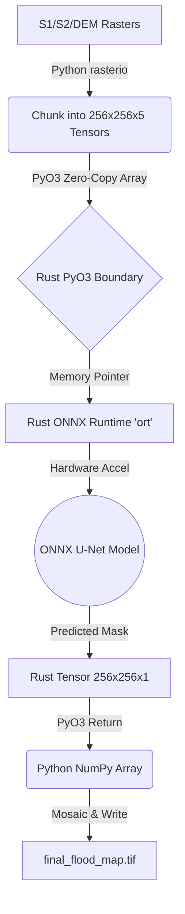

# DeepSAR A.E.C.O Architecture Design (U-Net + ONNX + Rust)

> **Reference:** Tian et al. (2026), "DeepSAR Flood Mapper: global flood mapping on google earth engine cloud platform using MLP deep learning model with Sentinel-1 SAR imagery and HAND" & Intarat et al. (2026), "FLOOD MAPPING IN PHRA NAKHON SI AYUTTHAYA, THAILAND, UTILIZING SENTINEL-1 SAR IMAGERY AND DEEP LEARNING APPROACHES".

This document outlines the architectural transition of the A.E.C.O system from a pixel-wise Tree-Based Ensemble (XGBoost/RF/LightGBM) to a Convolutional Neural Network (U-Net) approach for SAR flood segmentation.

## 1. System Motivation

While the current pixel-wise ensemble is highly optimized (zero-copy Rust, memory efficient), it lacks **spatial context**. A pixel is evaluated purely on its own values (`NDWI, SAR_mask, Slope, VV, VH`).

A U-Net architecture (Encoder-Decoder with skip connections) evaluates a pixel *and its neighborhood*, understanding spatial patterns like:
- **River connectivity:** Is this pixel part of a continuous water body?
- **Speckle context:** Is this a single noisy pixel or a flooded area?
- **Topographic constraints:** Does the flooded area conform to the valley floor?

## 2. Target Architecture: The "Rust-ONNX" Pipeline

To maintain A.E.C.O's core design philosophy (Python for orchestration, Rust for compute), the U-Net inference will be executed via **ONNX Runtime embedded directly inside the PyO3 Rust Engine**.

### 2.1 Component Stack

| Component | Technology | Responsibility |
|-----------|------------|----------------|
| **Model Training** | PyTorch / TensorFlow | Train U-Net on labeled patches (256x256), export to `.onnx`. (Done offline). |
| **Model Format** | ONNX (Open Neural Network Exchange) | Standardized, highly optimized representation of the U-Net graph. |
| **Inference Engine**| Rust (`ort` crate) | Load ONNX model, execute tensor operations in parallel using Rust, avoiding Python GIL. |
| **Orchestration** | Python (`flood_rs` via PyO3) | Python passes raster chunks to Rust; Rust returns predicted masks. |

### 2.2 Inference Data Flow



## 3. Implementation Phases

### Phase 1: Training Data Generation (Python)
Transition from pixel sampling to **patch sampling**.
- Create `src/dataset_builder.py` to slide a 256x256 window across `feature_stack.tif` and `flood_labels.tif`.
- Filter out tiles with 100% background or >50% NoData.
- Output: TFRecord or PyTorch `.pt` datasets.

### Phase 2: U-Net Model Definition & Training (Python/PyTorch)
- Create `src/unet_model.py`.
- Architecture: 5-channel Input (NDWI, SAR Mask, Slope, VV, VH) → U-Net (with batch norm and dropout) → 1-channel Output (Sigmoid probability).
- Loss Function: **Dice Loss + Binary Cross Entropy** (to handle severe class imbalance where flood pixels are rare).
- Export: `torch.onnx.export(model, dummy_input, "outputs/models/unet_flood.onnx")`.

### Phase 3: Rust ONNX Integration (Rust)
Modify `rust_engine/Cargo.toml` to include the `ort` crate.

```rust
// Proposed Rust signature for inference
#[pyfunction]
fn predict_unet_chunk<'py>(
    py: Python<'py>,
    tensor_chunk: PyReadonlyArray4<'py, f32>, // (Batch, Channels, H, W)
    model_path: &str,
) -> PyResult<Bound<'py, PyArray4<f32>>> {
    // 1. Load ONNX model via `ort` crate
    // 2. Pass tensor_chunk
    // 3. Execute inference
    // 4. Return probability mask
}
```

### Phase 4: Prediction Orchestration (Python)
Modify `src/predict.py`.
- Because U-Nets expect specific input sizes (e.g., 256x256), the prediction script must implement **smooth overlapping inference**.
- Slide a 256x256 window over the full image with a stride of 128 (50% overlap).
- Use a 2D Gaussian weight matrix to merge overlapping predictions, avoiding edge artifacts.

## 4. Hardware Considerations for Edge Deployment

If A.E.C.O is deployed on Edge devices (per Khan et al. 2025):
- **CPU Only:** ONNX Runtime in Rust is highly optimized for multi-core CPUs.
- **GPU (NVIDIA Jetson):** ONNX Runtime can target TensorRT.
- **Quantization:** The `.onnx` model can be quantized from FP32 to INT8, reducing model size by 4x and increasing inference speed by ~2.5x with minimal accuracy loss.

## 5. Transition Strategy

1. **Keep the Ensemble:** Do not delete `model.py` (XGB/RF/LGBM). It remains the baseline and fallback.
2. **Parallel Pipeline:** Build the U-Net pipeline alongside it.
3. **Compare & Validate:** Use `scripts/benchmark.py` to compare speed and IoU metrics between the Pixel-Ensemble and the Spatial-UNet.